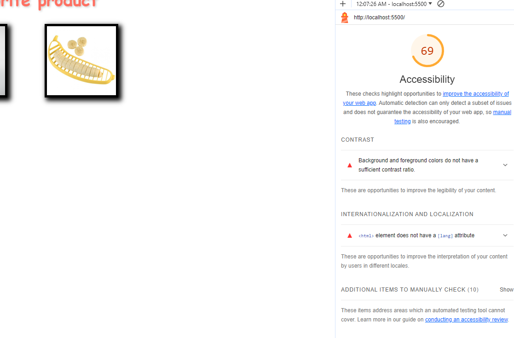

# LAB - 13

## Odd Duck

This app will take a survey and display the number of votes and views of each image. In addition to that, the app will store the data in the local browser database. 

### Author: Felix A. Taveras

### Lighthouse Accessibility Report Score

* 

### Reflections and Comments

* Loved the CSS
* It took great effort to figure out how to completely randomize everything.
